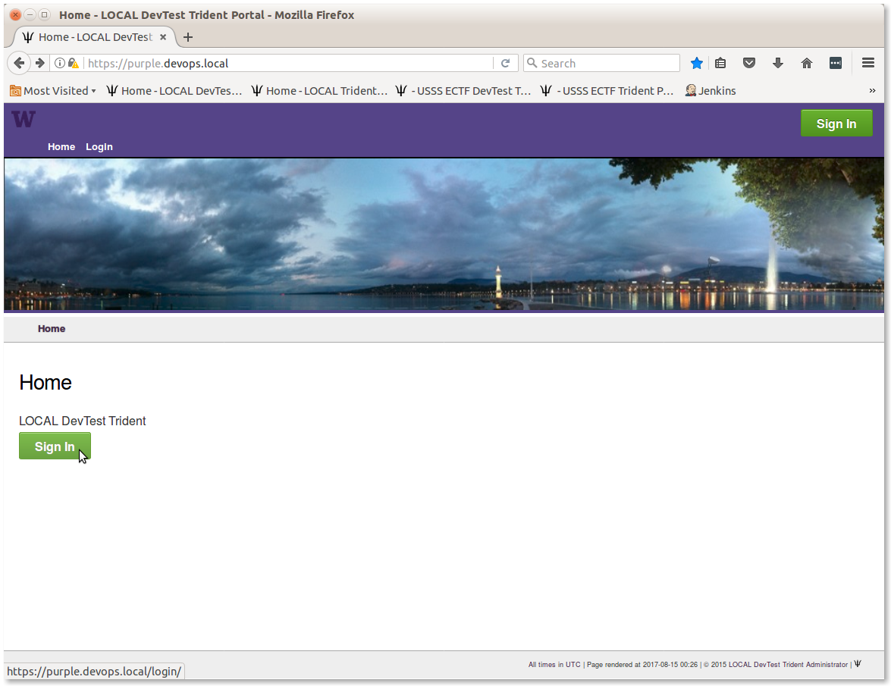

.. trident-user-manual documentation master file, created by
   cookiecutter on 2017-03-26.
   You can adapt this file completely to your liking, but it should at least
   contain the root `toctree` directive.

.. _tridentusermanual:

Trident User Manual v |release|
===============================

This document serves as a guide to using a `Trident`_ portal trust group
management system [#tg]_ as a trust group administrator or a trust group member.

.. _trident_login_page:

   Trident Login Page

..

.. note::

   This is not an official document of the Trident project or its sponsors.
   In some places it cites and/or refers to content on the `Trident`_ web
   site.  It was written based on the author's own experience as a trust group member who
   has used the ops-trust (and now Trident) portal system [#tg]_ as well as
   membership in multiple other closed security groups since the late 1990s. Its
   purpose is to support a pilot deployment of a Trident portal as
   part of the Distributed Incident Management System (DIMS) project. DIMS uses
   a Trident portal at the core of a larger open source distributed system for
   incident response event management. You can find more information on DIMS,
   including links to source code and other related documentation, at
   https://staff.washington.edu/dittrich/home/dims.html.

..

.. [#tg] Thanks to Paul Vixie who designed, implemented, and operated the original Ops Trust software infrastructure for its first few years. In response to an early request from Nick Ianelli, Vixie virtualized the original Ops Trust membership and trust set into a single silo inside of a new multiple-memberships multiple-trust-sets system. Such silos needed a category name, and in that moment, Vixie coined the term "*trust group*". This may have been Vixie's most important contribution, and in the spirit of innovation, it was accidental.

Chapter Index
~~~~~~~~~~~~~

.. toctree::
   :maxdepth: 2
   :numbered:

   introduction
   trustgroups
   trustgroupadmin
   trustgroupuser
   license

.. sectionauthor:: Dave Dittrich <dittrich @ u.washington.edu>, Megan Boggess <mboggess @ uw.edu>

.. include:: <isonum.txt>

Copyright |copy| 2017 University of Washington. All rights reserved.

.. _Trident: https://trident.li
