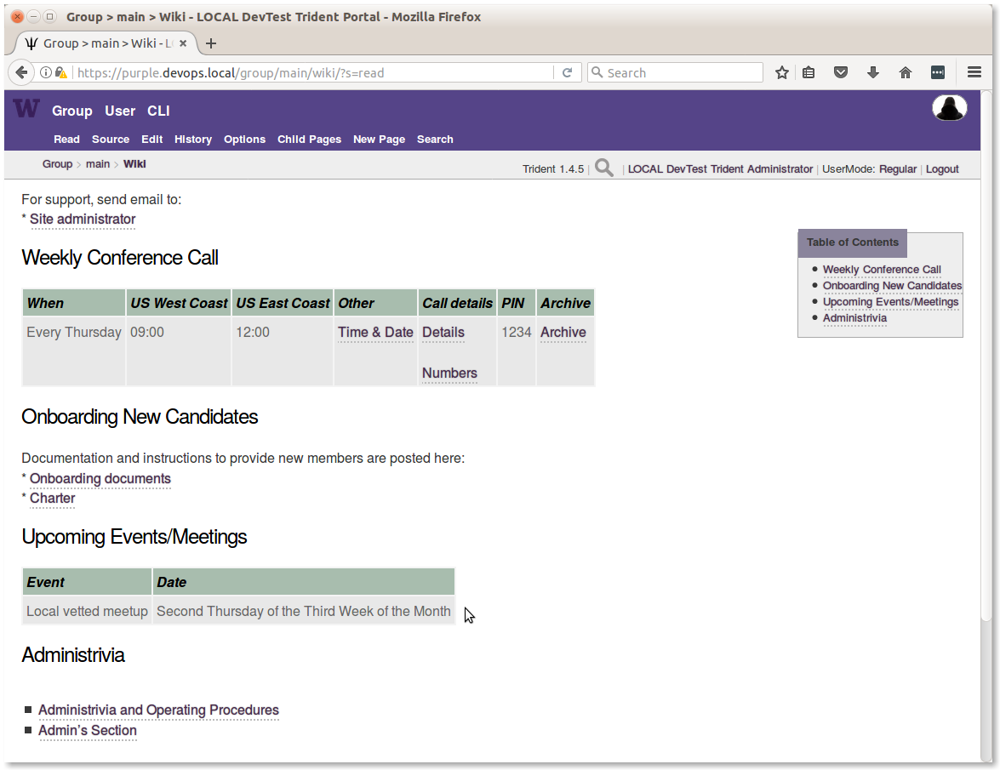
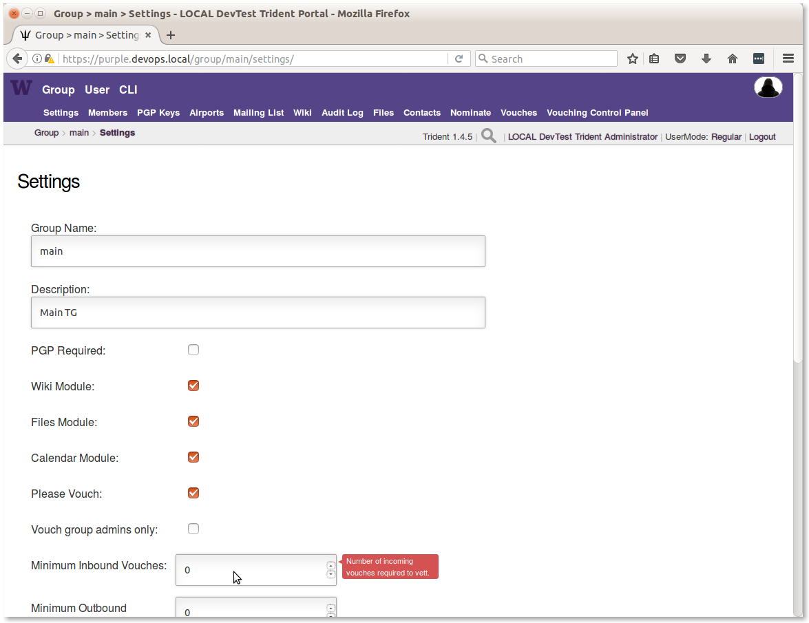
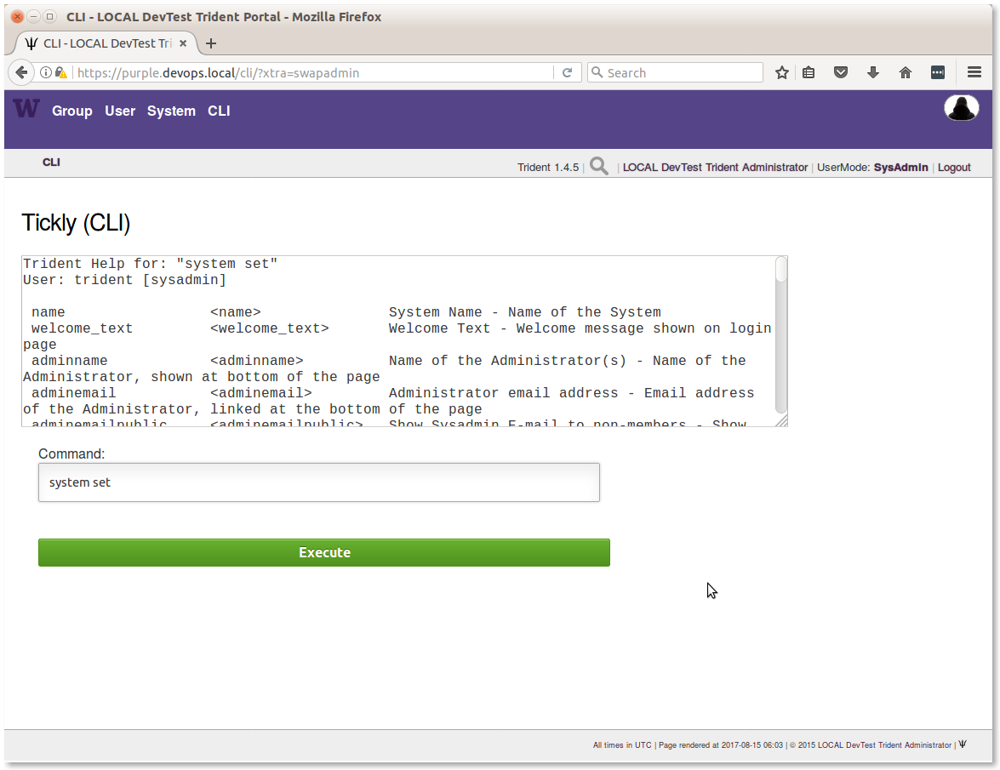
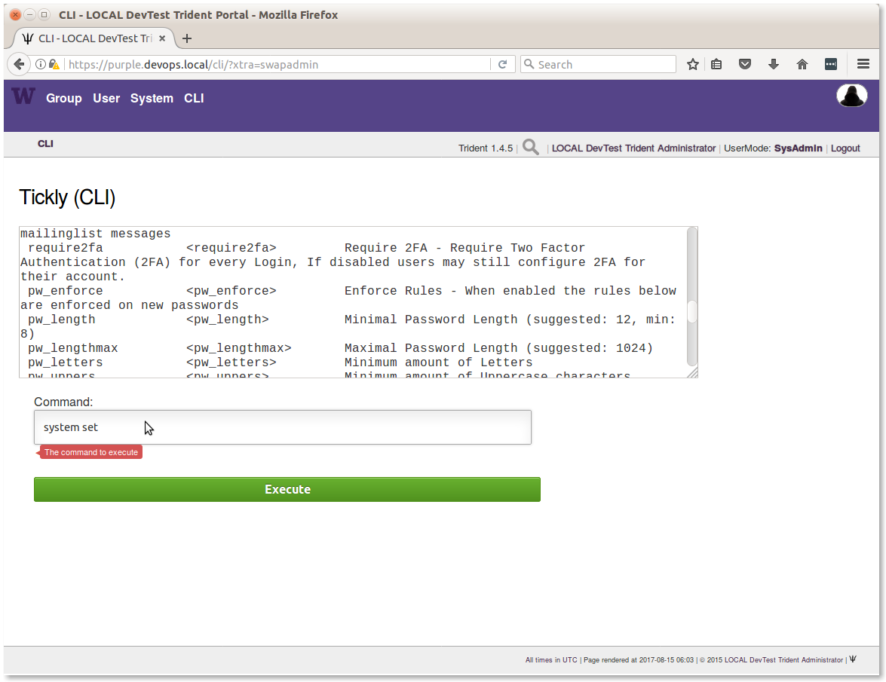

.. _trust_group_admin:

Trust Group Administration
==========================

.. attention::

    The way that the Trident portal is installed and configured using the
    :ref:`ansible_dims_playbooks:ansible_dims_playbooks`, some of the trust
    group configuration settings are set by the roles ``trident-core`` and
    ``trident-configure``. As described in Section
    :ref:`ansible_dims_playbooks:backup_directories`, any configuration
    changes made through the ``tcli`` command line interface, or the Trident
    portal interface, are independent of the variables in the Ansible inventory
    used to bootstrap the Trident portal. That means that any changes made
    interactively will be reverted to what the inventory says they should be
    the next time the ``trident-configure`` role is applied.

..

.. _tg_admins:

Trust Group Administrators
--------------------------

There may be more than one administrator in each trust group, depending on the
size and the activity level of the trust groups. The larger the group, the more
likely you will want more than one administrator to ensure that there are
multiple people keeping an eye on the portal and handling trust group policy
issues, as well as to make sure there is always someone available in case of
emergencies to keep the portal running.

Trust group administrators work with the site administrators to ensure trust
policy settings match the desired policy of the organization, including things
like branding, icons, domain names, etc.

While there are references in this document to Ansible inventory settings,
including excerpts from the inventory file showing the names of variables, this
document does not cover the underlying system administration aspects of
installing, updating, or patching the underlying operating portal system.  It
assumes that installation and configuration management of the server(s)
providing the Trident web and command line interfaces, Postgres database back
end, and Postfix email services were done as described in the
:ref:`ansible_dims_playbooks:ansible_dims_playbooks` document. Look to that
document for operating system level instructions.

.. _tg_admin_responsibilities:

TG Admin Responsibilities
-------------------------

TG admins should familiarize themselves with the history and political
issues that may arise when leading trust groups that were mentioned in
Chapter :ref:`trust_groups`. Other things that TG admins should do
include:

* Ensuring new TG members are aware of their responsibilities in regards to
  vetting, vouching, and handling sensitive information. This includes
  adjudicating issues regarding potential breaches of trust related to
  publication or public release of information shared in the trust group.

* Working with site administrators to work out and understand disaster recovery
  procedures in the event of hardware failures, emergency response procedures
  in the event of system outages during critical events, procedures for
  account revocation or temporary account disablement in the event of suspected
  account compromise, or other continuity of operations issues.

* Ensuring accuracy in meeting schedules, availability of dialup or online meeting
  systems availability for group teleconferences, and other administrivia.

Most of these tasks can and should be addressed with content placed into the
trust group wiki, where trust group members can refer to it whenever they
need. This also puts it behind the secure login front end of the portal, so
there is no need to share anything in clear text emails beyond an URL referring
to the content in the wiki (as long as the path and file name does not expose
sensitive information), or just a general reference to "see the TG wiki for more
information." Figure :ref:`trident_wiki_main` shows what that might look like.
(Editing this page is covered in Section :ref:`using_the_wiki`).

.. _trident_wiki_main:

   Main TG wiki page

..

.. _setting_tg_policies:

Setting Trust Group Policies
----------------------------

There are a group of policy settings that can be applied to
each trust group. They are found in the **Settings** page
on the **Group** menu as seen in Figure :ref:

.. _trident_main_settings:

   Main TG Settings

..

The following subset of variables from the ``inventory/trident/nodes.yml`` YAML
inventory file show those settings that are supported by
``ansible-dims-playbooks``. The names of the variables reflect those you would
use in ``tcli`` command lines (``tcli`` is the Trident Command Line Interface).

.. code-block:: yaml

   trident_site_trust_groups:
     - name: 'main'
       settings:
         descr: 'Main TG'
         pgp_required: 'no'
         has_wiki: 'yes'
         has_file: 'yes'
         has_calendar: 'yes'
         please_vouch: 'yes'
         vouch_adminonly: 'no'
         min_invouch: 0
         min_outvouch: 0
         target_invouch: 0
         max_inactivity: '4320:00:00'
         can_time_out: 'no'
         max_vouchdays: 0
         idle_guard: '168:00:00'
         nom_enabled: 'yes'

..

These are described by pop ups in the **Settings** panel, or can be
seen by using the **CLI** option to run ``tcli`` commands through the
portal GUI.  To do this, your account must be an admin account, and you must
toggle **UserMode** to be **SysAdmin** or use ``system swapadmin`` before
issuing ``system set`` to see help information about the settings as
shown in Figure :ref:`trident_tcli_system_set_1` and
Figure :ref:`trident_tcli_system_set_2`.

.. _trident_tcli_system_set_1:

   CLI ``system set`` (part 1)

..

.. _trident_tcli_system_set_2:

   CLI ``system set`` (part 2)

..

You would use ``system get`` to get the current settings, while
``system set`` would set them to new values.
