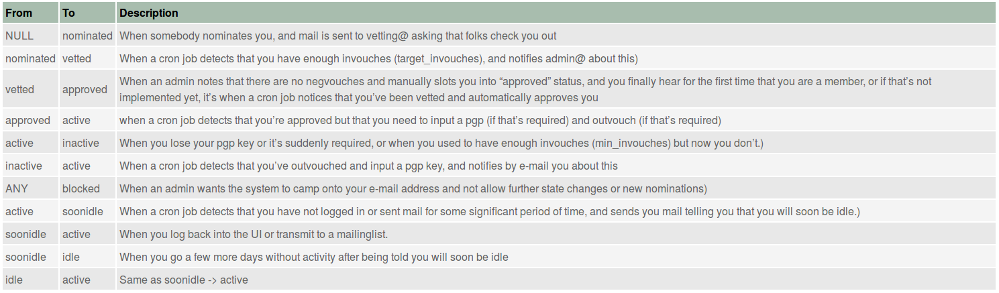
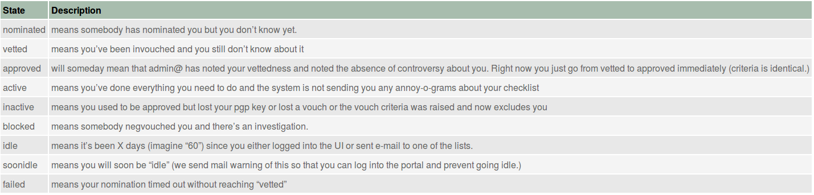
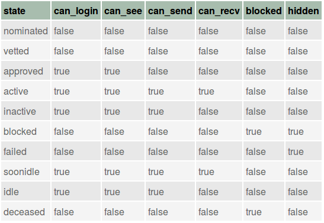
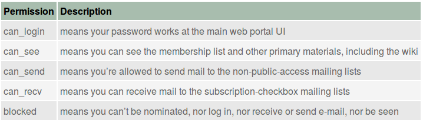

.. _trust_groups:

Trust Groups and Trident
========================

The concept of **trust groups** has its history in the efforts of computer
security researchers, network operators, and expert system administrators at
large sites, working together to help guide law enforcement and federal
government entities and organizations like Carnegie Mellon CERT/CC, in
combatting computer system and computer network compromises affecting the
integrity, availability, and/or confidentiality of information and information
systems.

These compromises, while sometimes innocent exploration, are none the less
potentially criminal acts. At the extreme, things like massive-scale
distributed denial of service (DDoS) attacks cost businesses who are disrupted
tens of thousands to potentially millions of dollars in lost revenue and
expenses. High profile data losses like those suffered by the likes of TJ Maxx,
Sony Pictures, Target, and Saudi Aramco arguably cost in multi-million dollar
range.

Those who perpetrate these crimes operate in the shadows, using pseudonyms.
They cover their tracks using proxies, stepping stones on compromised hosts at
innocent third-party sites, or sophisticated multi-layer distributed attack
networks commonly known as *botnets*, often operated at *bullet-proof hosting*
sites who are non-responsive to requests from the private sector or law
enforcement to stop the abuse.

Those who try to defend against these compromises, working with law enforcement
to try to bring the perpetrators into the criminal justice system. This may
mean disrupting the flow of millions of dollars in ill-gotten gains from
criminal acts. When someone impacts the flow of that much money, sometimes the
people who are profiting get unhappy and fight back.  For those reasons, *trust
groups* are formed to try to keep the efforts to counter the criminals secret
from those criminals.

.. _limitations_to_trust:

Limitations to Trust
--------------------

As pointed out by Raaum [`Raaum(2011)`_] in his Master's thesis on barriers to
trust, trust does not scale well (either within a single trusted information
sharing group, or across multiple trusted information sharing groups).
At the Coordinating Attack Response at Internet Scale (CARIS) workshop
[`Internet Architecture Board(2015)`_] at least two interviewees used the number
100 as the approximate limit at which trust within a single group begins to
noticeably decrease within the group. (The original ops-trust group from which
the Trident portal grew, has many times this number of members.)

Besides Raaum, there are other studies, reports, and resources related to
information sharing and trust (see [`Jøsang et al.(2006a)`_
`Jøsang et al.(2006b)`_ `Demolombe(2011)`_, `Evans and Mahoney(2011)`_])

To establish a strong trust fabric, the Trident portal supports a
rigorous vetting process workflow. This workflow depends on the members
of the trust group taking the process seriously and adhering to
the spirit of the process in their attestations of the trustworthiness
of prospective new members. This process is covered in more depth in
Section :ref:`vouching`.

.. Figure \ref{fig:populationcomparison} shows the more complicated nature of the
.. many trust groups, some overlapping and some not, with their individual
.. compositions of levels of expertise and skill sets. The composition of each
.. group impacts its perception, its choices about what to do in a given
.. situation, and possibly even its ability to have a broader impact on society at
.. large.
.. 
.. The overall box in depicts the two dimensions of size and expertise within each
.. members' specific discipline. The in the center depicts those with
.. \emph{technical} expertise in system operations, information technology,
.. networking, forensics, reverse engineering, etc. (I.e., the higher the level of
.. expertise, the fewer people there are in this subset of the general population.
.. Groups $A$ and $B$ on the left have similar percentages of technical vs.
.. non-technical members, but group $A$ has more experts and group $B$ has more
.. novices. Groups $A$, $D$ and $E$ have similar sub-populations of highly-skilled
.. experts, with some non-trivial overlap in membership at the highest level.
.. (This is typical of the many closely-vetted malware and crimeware related
.. groups that exist today with an operational security nature to their
.. activities.)
.. 
.. Figure \ref{fig:populationcomparison} has two interesting visual anomalies
.. (that in the real world are impediments to maximizing the defensive capacity
.. against computer intrusion activity globally.  Group $C$ has a very similar
.. composition to group $B$ in terms of skill level, with many members at a
.. relatively high level of technical expertise, but has no non-technical members
.. and has no overlap with any of the other groups. This means it will be
.. difficult, if not impossible, to have situational awareness of anything that is
.. not widely know to the general public.  That is to say, anything kept closely
.. held (even if commonly known because of their overlap in membership) within
.. groups $A$, $D$, and $E$ may not be known to group $C$, and vice versa.  Group
.. $C$ may have a skewed perception of reality due to the narrow technical focus
.. of its members.
.. 
.. \begin{figure}[htbp]
..   \centering
..   \includegraphics[width=0.900\linewidth]{population-comparison-v1.png}
..   \caption{Comparison of Overlapping Trust Group Populations}
..   \label{fig:populationcomparison}
.. \end{figure}
.. 
.. The issue of size within a single trust group is closely related to the issue
.. of \emph{Transitivity of Trust}, which often results in a degredation of trust
.. as data is shared repeatedly in a chain from one party to another. This can
.. happen when sharing data from one trust group to another, but also within a
.. large group where there are two or more degrees of separation in direct trust
.. relationships between group members. Raaum illustrates (Figure 1 and 2
.. in~\cite{thesis:raaumtrust}) that while $A$ may trust $B$, even if $B$ trusts
.. $C$, who in turn trust $D$, this may not mean that $A$ has any trust at all in
.. $D$. Similar to Raaum's Figure 2, Figure \ref{fig:transitivetrust} shows the
.. trust chain from $A$->$B$->$C$->$D$, which could implicitly mean that $A$ has
.. diminished trust in $D$ because of the trust chain through $B$ and $C$,
.. or that $A$ does not trust $D$, or has not yet developed a personal
.. \emph{Know, Met, Trust} style trust relationship to $D$.
..  J{\o}sang \emph{et al}~\cite{Josang:2006:SAT:1239776.1239778} have
.. described methods for calculating reputation in such trust networks.
.. 
.. \begin{figure}[htbp]
..   \centering
..   \includegraphics[width=0.900\linewidth]{transitive-trust-v1.png}
..   \caption{Transitivite Trust Relationships}
..   \label{fig:transitivetrust}
.. \end{figure}
.. 
.. 
.. The implication of this is that if $A$ believes that information they share
.. at TLP-AMBER may be similarly re-shared at the same level multiple times,
.. they may not be willing to share.
.. 
.. Demolombe notes a common \emph{a priori} assumption made by those discussing
.. the problems of transitive trust, which the assumption that the trust
.. relationship \emph{is} transitive. The interviews by Raaum, on the other
.. hand, showed that most trust groups used some method of \emph{vetting} to
.. strengthen the trust bond in larger groups rather than deal with transitive
.. trust directly (though the interviewees also commonly indicated smaller sized
.. groups generally had higher preceived levels of trust within the group.)
.. 
.. Lastly, is the issue of \emph{trust policy and enforcement}. Groups like
.. ops-trust operate on a strict ``no sharing without permission'' model.  Workshop
.. attendees pointed out that verification and shunning (i.e., vigorous
.. enforcement of policy) is intended to keep members of trust groups in line,
.. while another challenged those present to name an occasion when violation
.. of trust resulted in the party being expelled from the group.\footnote{In the
.. author's experience, this is a very rare event, but it does happen. More often
.. the result of a perceived breach is an angry internal email exchange, or possibly
.. a highly critical public blog post.}
.. _trust_and_ntk:

Trust and the Need to Know
--------------------------

The **Need to Know** is a primary and strong motivator for the sharing of
highly-sensitive information for incident response. At the same time,
need to know is a limiting factor on the sharing of information, since
the more people who have a piece of information, the greater the chances
that it loses its secrecy (in the worst case, becoming widely public).

Even in a tightly coherent trust group, not every member of the group needs to
know every piece of information. The person sharing the information must
decide whether the person they are sharing it with needs to know it, though
some people make the assumption that being a member of the trust group
by definition means they need to know it.

There are some mechanisms or tactics that are used to address
*need to know*.

+ Prior to sharing information, it can be tagged with labels defined by the
  `Traffic Light Protocol (TLP)`_ to indicate how to handle the information to
  protect it from disclosure. (See `FIRST announces Traffic Light Protocol
  (TLP) version 1.0`_ and `Traffic Light Protocol (TLP) Definitions and
  Usage`_.) The responsibility for handling TLP-tagged information properly
  then falls on the recipient.  An effort to define a more rigorous information
  sharing protocol known as the `Information Exchange Policy (IEP) - Version
  1.0`_ is being sponsored through `FIRST`_.

+ Rather than sending information in broadcast form to the full trust group
  membership, limiting the number of recipients by sending to a task-specific
  trust group list (e.g., a "warroom" list that focuses on operations-related
  information about emerging threats), or by sharing directly with individuals
  rather than sending to generic email lists.

+ For some sensitive operations, such as active investigations of criminal intrusion
  activity that is likely to move to criminal process, information must be tightly
  held. In those cases, creating a new trust group and limiting membership to
  just those victim sites who are involved is the right choice.  For this reason,
  spinning up new trust groups should be very low cost, and retiring them when
  the incident is resolved should be just as easy.

.. _trust_group_formation:

Trust Group Formation
---------------------

Trust groups are commonly formed by a group of individuals with a
common goal of protecting their own networks, responding to common
threats, and ideally collecting information about compromises to their
computer and network assets to provide them to others (up to and
including law enforcement, who may eventually bring evidence to
grand juries and courts of law in the criminal process.)

Trust group formation typically goes like this:

#. Someone takes the lead and offers to form the group.

#. The leader, or someone who wants to help them, sets up an email
   list server.

#. The initial members populate the list and start communicating over it.

#. For the next month or two, list members send the leader suggestions
   for new members, or they send the suggestion to the list. The leader
   asks existing members if the suggested new members should be trusted,
   and a handful of members respond to the list (or directly to the
   leader) with their opinions. The leader then makes a command decision for
   the new members and manually adds them to the list. This takes a significant
   amount of the leader's time.

#. Every now and then, someone wants a list of all of the current members,
   with their contact information. Not wanting to send this out in a clear-text
   email, the leader figures out how to encrypt an Excel spreadsheet. Then the
   leader sends the password (in clear text, but in a different message) to
   get it to the list. (This is slightly better than just sending the list
   in clear text.)

#. Periodically, during a crisis event in the news, someone asks for indicators
   or feedback about potentially malicious sites, malware, etc. They ask that
   the details be sent directly, not to the list (defeating somewhat the purpose
   of a list for sharing actionable information).

#. On a regular basis, information about upcoming meetings, events, etc., is
   sent to the list. Sometimes a flurry of emails occurs if the exterior door
   to the building is locked prior to the meeting. This creates noise on the list
   for those who could not attend and don't need to know that the door is locked.

#. When a cyber exercise occurs, a flurry of exercise emails are sent to the list
   (that are marked something like "EXERCISE - NOT REAL!" with headlines about
   buildings exploding and major DDoS events taking down the power grid. Anyone
   who is not participating in the exercise has their inbox spammed that day
   and just deletes everything with the list address (loosing the announcement
   about the next meeting, which was hidden in the noise.)

#. At some point, members start to gripe about not having a wiki for notes, not
   having a secure place to upload indicators and securely store the membership
   list (which is now out of date and the leader needs to spend a couple hours
   updating it), and for only having one email list that carries all of the
   communication.

While this is somewhat in jest, all of these things actually do happen. The
Trident portal (actually its predecessor, the ops-trust portal) was designed
specifically to meet the requirements implicit in the above listed friction
points. It handles the vetting and vouching workflow, supports a wiki,
secure file upload storage, encrypted mailing lists, idle user detection,
multi-factor authentication, and much more.

Trust Group Membership Life-cycle
--------------------------------

.. note::

    The Figures in this section come from the `Trident Documentation`_ page.
    There may be inaccuracies due to changes in the code base over time.
    If you notice any discrepancies, please report them (or issue a pull
    request) to help get them updated.

..

Figure :ref:`trident_state_table_1` shows a list of the *states* in which
a member may exist.

* The process starts by an existing member or trust group administrator *nominating*
  a new member, giving them a user name, establishing their email address, and
  registering a *vouch* for their trustworthiness.
  
* Current members of the trust group are notified of the nomination and are then
  able to *vouch* for the person themselves. Anyone wishing to register a private
  concern over the trustworthiness of the person can contact a trust group or
  system administrator to let them know about the concern.
  
* When a sufficient number of positive vouches is registered, the person reaches
  the ``approved`` state and a system password is prepared for secure transmission
  to the new user to allow them to log in to the portal and complete their account
  profile.

* Once the new user's profile is complete, their GPG/PGP key is uploaded, 
  and they have registered some vouches themselves to help grow the
  bi-directional trust network, their account becomes ``active`` and they
  begin to receive emails for lists to which they are subscribed.

Other states are reached when users are idle, are blocked because of some
serious breach of trust (for example, they are arrested for suspicion of
a crime), or they did not receive enough vouches to become active in the
first place.  The table in Figure :ref:`trident_transitions` describes
these state transitions.

.. _trident_transitions:

   Member state transitions

..

.. _trident_state_table_1:

   Member states and what they mean

..

The table in Figure :ref:`trident_state_table_2` shows what
permissions apply to a user account in a given state. The table
in Figure :ref:`trident_permissions` details those permissions.

.. _trident_state_table_2:

   Permissions in each state

..

.. _trident_permissions:

   Permissions descriptions

..

.. _Trident Documentation: https://trident.li/doc/
.. _Traffic Light Protocol (TLP): https://www.first.org/tlp/
.. _Traffic Light Protocol (TLP) Definitions and Usage: https://www.us-cert.gov/tlp
.. _FIRST announces Traffic Light Protocol (TLP) version 1.0: https://www.first.org/newsroom/releases/20160831
.. _Information Exchange Policy (IEP) - Version 1.0: https://www.first.org/iep/
.. _FIRST: https://www.first.org/
.. _Raaum(2011): M. Raaum. Barriers of trust in information sharing networks. Master’s thesis, 2011. URL http://brage.bibsys.no/xmlui/bitstream/id/101429/Margrete%20Raaum.pdf.
.. _Internet Architecture Board(2015): Internet Architecture Board. Workshop on Coordinating Attack Response at Internet Scale (CARIS). https://www.iab.org/activities/workshops/caris/agenda/, June 2015.
.. _Jøsang et al.(2006a): A. Jøsang, E. Gray, and M. Kinateder. Simplification and analysis of transitive trust networks. Web Intelli. and Agent Sys., 4(2):139–161, Apr. 2006. ISSN 1570-1263. URL http://dl.acm.org/citation.cfm?id=1239776.1239778.
.. _Jøsang et al.(2006b): A. Jøsang, R. Hayward, and S. Pope. Trust network analysis with subjective logic. In Proceedings of the 29th Australasian Computer Science Conference - Volume 48, ACSC ’06, pages 85–94, Darlinghurst, Australia, Australia, 2006. Australian Computer Society, Inc. ISBN 1-920682-30-9. URL http://dl.acm.org/citation.cfm?id=1151699.1151710.
.. _Demolombe(2011): R. Demolombe. Transitivity and Propagation of Trust in Information Sources: An Analysis in Modal Logic, pages 13—28. Number LNAI 6814 in CLIMA XII 2011. Springer Berlin / Heidelberg, 2011. https://pdfs.semanticscholar.org/9a52/ef21ebfa692ba3f6257e76f32daafad913ff.pdf.
.. _Evans and Mahoney(2011): R. Evans and G. Mahoney. Distributed Policy Domain Model: An engineering approach to balancing the local and global concerns of any large system involving digital identity, trust, and information sharing., February 2011. http://www.cio.gov.bc.ca/local/cio/informationsecurity/documents/PS_2011_PDFs/TrustandInformationSharingwithinGovernment-DistributedPolicyDomainModel-20110216.pdf.
