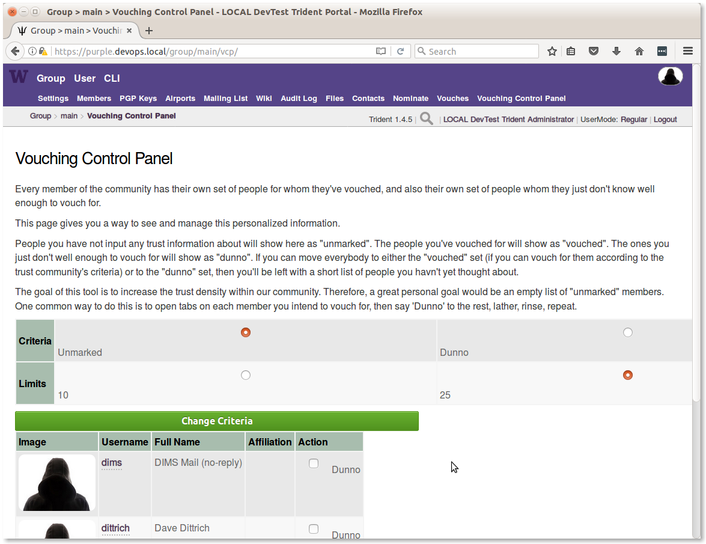
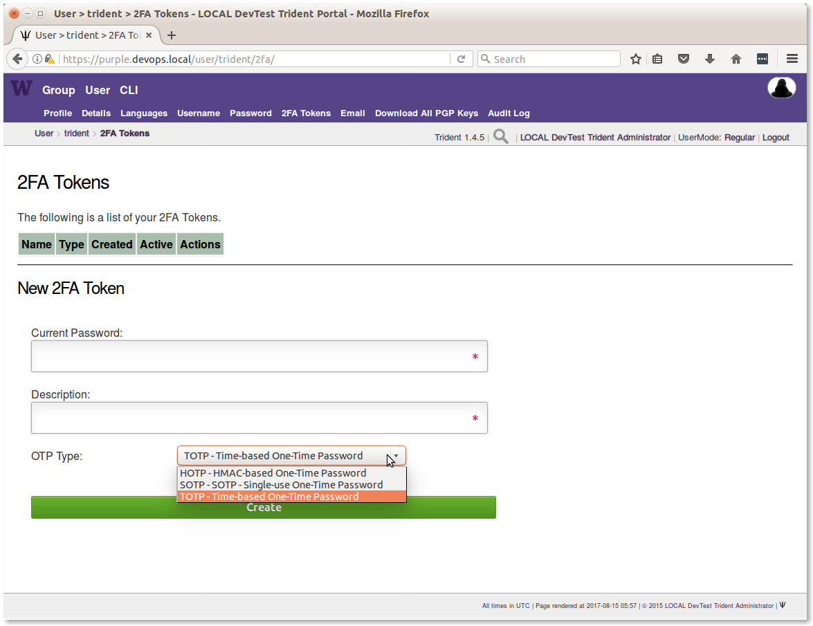
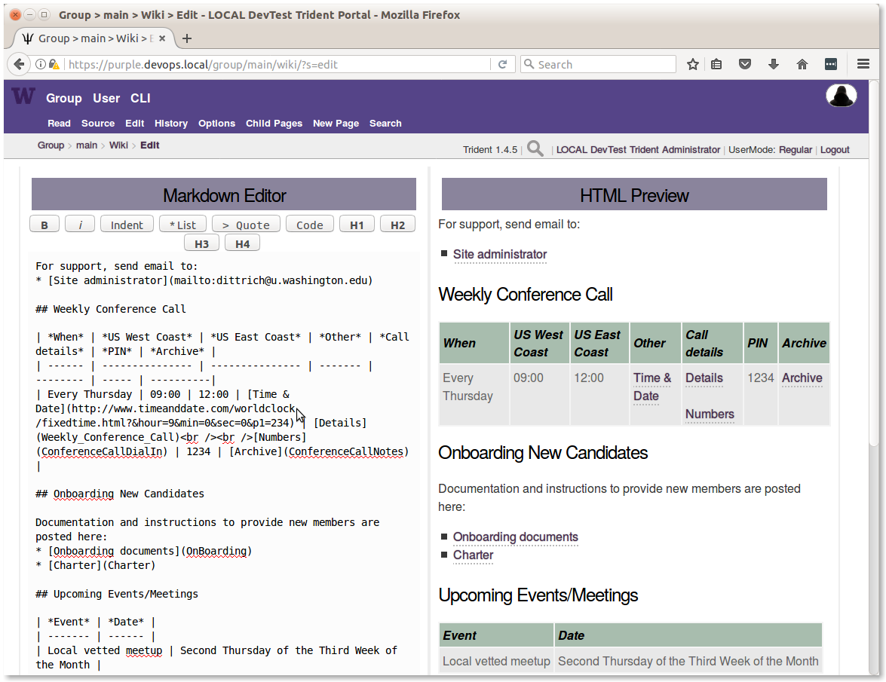
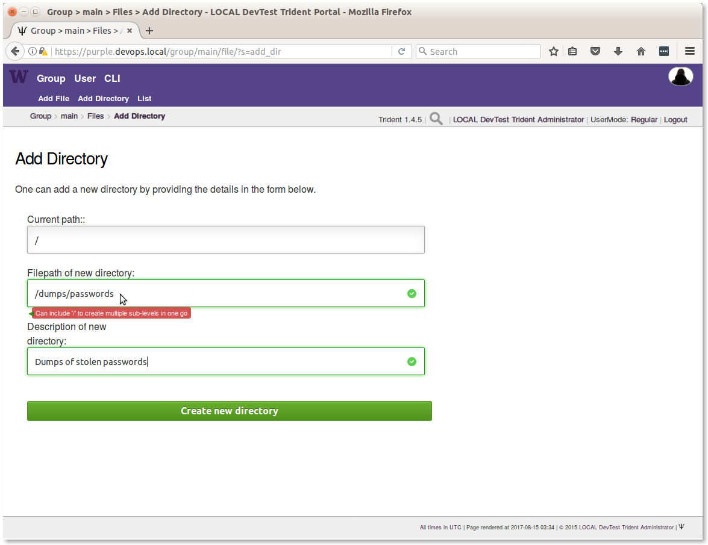
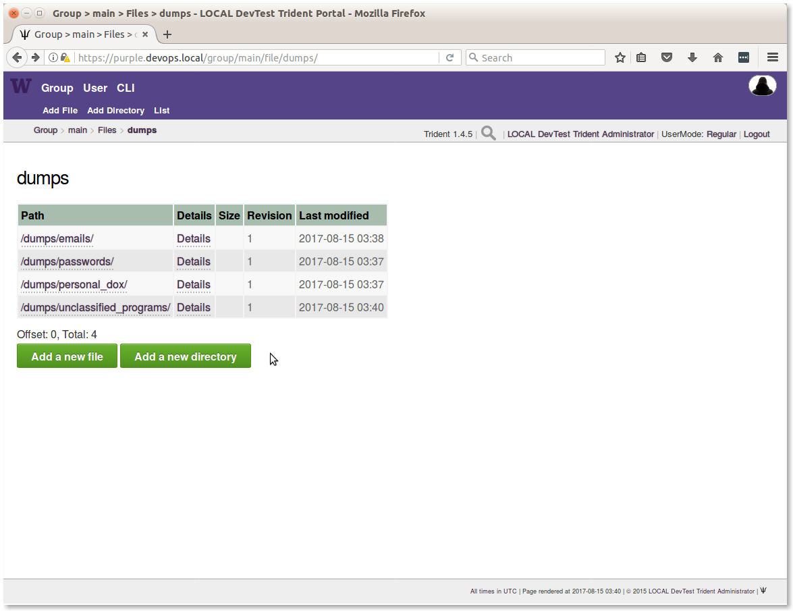

.. _trust_group_user:

Trust Group Member Activities
=============================

.. _using_gpg:

Using GPG or PGP Encrypted Email
--------------------------------

Encrypting email messages using public/private key cryptography is one of the
core means of protecting electronic communications, both in transit as well as
in storage.  One of the first programs to gain wide-spread use for encrypting
email communications was Phil Zimmerman's Pretty Good Privacy (PGP). PGP
eventually become a commercial product, prompting development of a compatible
free alternative as part of the GNU project known as GNU Privacy Guard (GPG).
[*]_

While GPG/PGP may be disliked by many because of the complexity of managing
time-limited keys, signatures that are used to create trust chains, and
contents of key rings, these programs do work well and there aren't any viable
alternatives that are available freely and in widespread use. They also support
things beyond just encrypted email.

Public/private key cryptography also supports creation of digital signatures of
messages and files that prove they were created by the person in control of the
private key used to sign the message or file. [*]_ Cryptographic hashes like
SHA256 can be used to verify the integrity of a file by comparing the hash,
so they are often provided along side software packages to help validate the
integrity of that software. But if someone can gain access to the distribution
server and alter both the software package file *and* the hash of that file
(which are usually both stored on the same server), they can slip a trojan
horse through the gate!  For this reason, the files containing hashes for
integrity validation are often signed with PGP to verify both their integrity
as well as who produced them. The same technique can be used with PGP to sign
files containing Indicators of Compromise, intrusion reports, or log files
extracted from compromised hosts to help prove *chain of custody* of potential
digital evidence. For this reason, incident responders should know how to
produce timestamped signed files using PGP.

PGP keys and the GPG library are used internally to Trident to support
encrypted email lists. Every list has its own key generated internally,
allowing any list member to encrypt a message *to the list address*. The
internal email processing scripts decrypt the message, then re-encrypt it to
each list member using the list's private key and the list member's public key,
ensuring that all list traffic is encrypted in both directions. This is a very
powerful capability that helps trust groups maintain secure communications
about very sensitive topics. Every trust group members' PGP key is available,
along with every key for every list that someone is subscribed to, when you
select **PGP Keys** in the sub-menu for the selected trust group.  Keys should
be updated regularly to deal with trust group membership and list subscription
changes.

Because PGP keys are so fundamental to encrypted email in Trident, one of the
very first tasks that a new user must perform is to upload a PGP key. This
is covered in Section :ref:`tridenttrainingmanual:userPGPKeysManagement`
of :ref:`tridenttrainingmanual:tridenttrainingmanual`.

If you have not used PGP before, take some time to review the following guides
to get a complete picture of how public/private key cryptography works in
general, and how PGP works in particular with email clients like Thunderbird
with Enigmail.

  * `EMAIL SELF-DEFENSE`_ guide, Free Software Foundation
  * `An Introduction to Public Key Cryptography and PGP`_, Electronic Frontier Foundation

For step-by-step instructions, EFF has the following guides that are
very helpful:

  * `Surveillance Self-Defense`_ tutorials, Electronic Frontier Foundation
    + `How to: Use PGP for Linux`_
    + `How to: Use PGP for Mac OS X`_
    + `How to: Use PGP for Linux`_

.. _vouching:

Vouching in the Vetting Process
-------------------------------

Vouching for someone is a serious matter. It is a public attestation of trust
in someone else. The Trident portal vouching panel has three toggles that are
required to be enabled as part of the attestation before a nomination will
proceed:

  * **I have met them in person more than once**
  * **I trust them to take action**
  * **I will share membership fate with them**

By answering these questions in the affirmative, it means that you have had
sufficient personal experience with someone to warrant trust in them to use
information provided to them to minimize harm to those being victimized on the
Internet and to keep that information secure to minimize any negative
consequences to those countering the activity of the criminals who are harming
these victims. Should they breach the trust placed in them resulting in a
decision by the group to expel them, you may also be expelled.

There is a *vouching control panel* intended to facilitate this process
when the group gets large. You can read the reasons for its existence, and
how to use it, on the page (see Figure :ref:

.. _trident_vouching_control_panel:

   Vouching Control Panel

..

All members should spend the time to vouch for everyone they can, to help grow
and strengthen the trust fabric. This is important to have in place prior to an
urgent active threat situation, when those responding come across information
related to intermediary systems (e.g., "stepping stones" or command and control
resources). When someone has no experience with any staff at an involved
intermediary site, there is no way to know if the person you reach out to will
be helpful, or whether they are protecting the criminals and will lie to you
and inform the criminals that someone is on to them.) Being able to identify
someone, and identifying someone you trust who in turn trusts them, allows this
contextual transitivity of trust to guide decisions about who to inform and
what to say.

.. _nominating:

Nominating a New Member
-----------------------

To nominate a new member, you are first asked to search for an email
address. This will identify whether the person you wish to nominate is
already in the nomination process (or a member). If they are not found,
you are prompted to fill in some of the information to start their profile,
which includes:

  * Full name
  * Affiliation (e.g., ``@their-company.com``)
  * A short biography (they can update it later if they don't like it)
  * A vouch comment (e.g., "I have known John Smith and worked with him on several incident responses over the past five years.")

You must then toggle on each of the three attestations described in Section
:ref:`vouching`.

An email will be sent confirming the nomination has started, asking that
the nominator let others know about the nominee to seek vouches from people who
are willing and able to vouch.

When a sufficient number of vouches has been received, and a trust group
administrator has approved the successful nomination in the portal, an encrypted
email message is sent to the nominator with the new member's password and
instructions on how to securely provide the password to the new member. The
member must change their password on initial login, so they will be the only
one to know their portal password.

.. note::

    Trident supports the use of multiple forms of second-factor authentication,
    or **2FA**, which site administrators are encouraged to require by policy,
    or at least enable for members to use. This is a simple mechanism, with
    only a little added friction and cost, to defeat password guessing or
    password theft due to phishing or keystroke logging. The **2FA Tokens**
    page is shown in Figure :ref:`trident_2fa_tokens`.

..

.. _trident_2fa_tokens:

   2FA Tokens Registration Page

..

.. _password_reset:

Requesting a Password Reset
---------------------------

When requesting a password reset, 

.. code-block:: none

   Dear John Smith,

   A password reset request was made for:
    Bobby Tables <littlebobby@drop.table.example.com>

   As you are a nominator of this person, you are receiving
   the second portion of this email.

   Please inform Bobby Tables
   of the following Nominator Portion of the password reset:
      XhXblRH_6c5BWul

   Regards,
     LOCAL DevTest Trident

..

.. note::

   Password resets are a very frequent occurrence, which means they
   have a high system administration overhead cost.  Upcoming changes to
   the Trident portal should result in the password reset behavior changing
   to be a little more flexible and easier to perform.

     + If the user has a PGP key configured in the portal, send them an email
       with their new password with the message encrypted to their public key.

     + If no PGP key is available, send 1/2 of the recovery token to the
       nominator and the other half to the user in cleartext email like the
       portal does now. (The nominator should still communicate their portion
       to the user using an out-of-band mechanism (e.g., a phone call or SMS
       message.)

     + A possible 3rd option would allow a system administrator or trust group
       administrator to see 1/2 of the token in the portal, with the other 1/2
       of the token being sent directly to the trust group member.

..

.. _using_the_wiki:

Using the Wiki
--------------

Trident supports a built-in wiki that uses a version of the Markdown language
for simple formatting. When the wiki is enabled in the system settings, the
word **Wiki** appears on the submenu for the selected Trust Group (e.g., **Main
TG**). Each trust group has its own wiki.

Use of the wiki is described on the Trident `Wiki`_ page. Figure
:ref:`trident_wiki_main_edit` shows what it looks like when editing the Main TG
wiki page from Figure :ref:`trident_wiki_main`.

.. _trident_wiki_main_edit:

   Editing the Main TG wiki page

..

.. _adding_files:

Adding Files
------------

When file upload is enabled in the system settings, the word **Files**
appears on the submenu for the selected Trust Group (e.g., **Main TG**).
Each trust group has its own file storage.

* Users can **Add a new directory** to create a folder in which to store files.

* Users can **Add a new file** to the selected directory folder.

Figure :ref:`trident_files_newpath` shows how to create a nested
directory using a multi-component directory path.

.. _trident_files_newpath:

   Creating a directory path

..

.. note::

    It is a good idea to organize files into directories, rather than just have
    all files in one place. Start with a set of top level directories to
    categorize things at a high level, then use subdirectories within those
    categories to further organize content. The structure to use will vary,
    depending on requirements, but some organization is warranted to make it
    easier to find files as the number of files grows.

..

.. _trident_files_dumps:

   Main TG files/dumps/ directory

..

.. caution::

   Pay **very close attention** to the directory for dumps, which was
   purposefully named ``/dumps/unclassified_programs``. While it has become
   common for dumps of stolen **SECRET** and **TOP SECRET** documents and
   programs to be made public on leak web sites, or found in underground web
   sites, this does not mean they can or should be freely accessed and shared
   within trust groups. Their presence should be reported to federal law
   enforcement agents immediately to allow them to deal with uncontrolled
   classified materials.
   
   Trust group administrators should make it **very clear** to all TG members
   that they should **NEVER COPY LEAKED PROGRAMS OR FILES MARKED "CLASSIFIED
   SECRET" OR "CLASSIFIED TOP SECRET" OF ANY KIND** into the portal. **Ever**!
   To do so puts trust group members who hold national security clearances in a
   problematic position in which they must legally report the files, which must
   be scrubbed from the system by cleared personnel. This is a very disruptive
   and time consuming process that could get you expelled from the trust group
   and/or interviewed by federal law enforcement agents.

.. [*] The phrase "in control of the private key" is important to understand here. The digital signature validates which private key produced the signature, but that may not be the same person who has a copy of the private key. If someone's account is compromised, so is their private key. For this reason, a strong passphrase on the private key helps (but it, too, can be captured by keystroke logging, shoulder surfing, etc. Pay attention to the referenced guides' advice on securing your private key.
.. [*] For the purpose of this document, and because the Trident portal uses the acronym internally, **PGP** will be used to refer to both GPG and PGP.

.. _Wiki: https://trident.li/doc/#toc_7
.. _EMAIL SELF-DEFENSE: https://emailselfdefense.fsf.org/en/
.. _An Introduction to Public Key Cryptography and PGP: https://ssd.eff.org/en/module/introduction-public-key-cryptography-and-pgp
.. _Surveillance Self-Defense: https://ssd.eff.org/en
.. _How to\: Use PGP for Linux: https://ssd.eff.org/en/module/how-use-pgp-linux
.. _How to\: Use PGP for Mac OS X: https://ssd.eff.org/en/module/how-use-pgp-mac-os-x
.. _How to\: Use PGP for Windows: https://ssd.eff.org/en/module/how-use-pgp-windows

